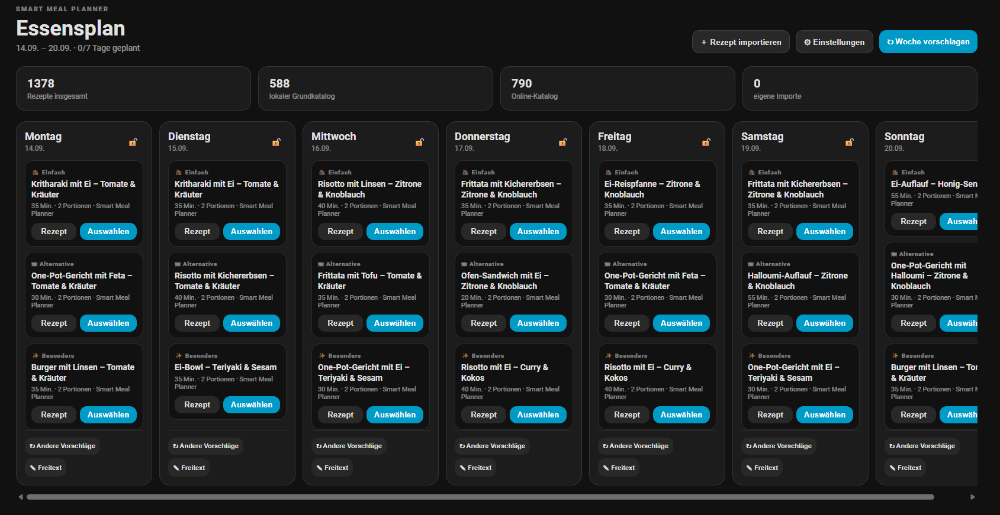

<!--
# SPDX-License-Identifier: Apache-2.0
# Copyright 2026 Lennox Matzerath (GamingonTour1)
-->

# Smart Meal Planner für Home Assistant

[](https://github.com/hacs/integration)
[](https://github.com/GamingonTour1/ha-smartmeal-planner/releases)
[](https://github.com/GamingonTour1/ha-smartmeal-planner/stargazers)
[](LICENSE)

Smart Meal Planner ist eine eigenständige Home-Assistant-Custom-Integration zur Wochenplanung von Mahlzeiten. Die Integration stellt für jeden Wochentag drei passende Essensvorschläge bereit und berücksichtigt dabei individuell konfigurierbare Regeln wie Ernährungspräferenzen, Zutaten, Kochzeit, Wiederholungen und Wochenlimits.

Ein externer Rezeptmanager ist nicht erforderlich. Der integrierte Rezeptkatalog funktioniert vollständig lokal. Zusätzlich können Rezepte von Webseiten importiert und optional Rezepte über TheMealDB synchronisiert werden.

<p align="center">
  <br>
  <em>Essensplan</em>
</p>

## Funktionen

- vollständige Wochenansicht von Montag bis Sonntag direkt in Home Assistant
- drei Vorschläge pro Tag: Alltag, Alternative und besonderes Gericht
- 588 integrierte strukturierte Rezeptvarianten ohne API-Key
- Rezeptansicht mit Zutaten, Zubereitung, Kochzeit, Portionen, Bild und Quelle
- konkrete Mengenangaben mit Gramm, Milliliter, Stück, EL und TL für den integrierten Rezeptkatalog
- automatische Skalierung der Zutatenmengen auf die konfigurierte Haushaltsgröße
- Auswahl eines Vorschlags oder Eintrag eines eigenen Freitext-Essens
- einzelne Tage oder die gesamte Woche neu planen
- einzelne Tage sperren, damit sie beim erneuten Planen unverändert bleiben
- Mindest- und Höchstwerte pro Woche für Fisch, vegetarische Gerichte und Fleisch
- Höchstwerte pro Woche für Nudel-, Reis-, Kartoffel- und besondere Gerichte
- getrennte maximale Kochzeit für Werktage und Wochenende
- ausgeschlossene Zutaten
- bevorzugte Zutaten
- typische Vorräte
- Wiederholungssperre für bereits ausgewählte Rezepte
- Rezeptbewertung zur Beeinflussung zukünftiger Vorschläge
- dauerhaftes Sperren einzelner Rezepte
- lokaler, persistenter Speicher innerhalb von Home Assistant
- Import von Rezepten über Webseiten mit `schema.org/Recipe`-Daten
- optionaler Online-Rezeptkatalog über TheMealDB
- Home-Assistant-Sensoren, Buttons und Aktionen für Automatisierungen und Skripte

## Voraussetzungen

Für die lokale Nutzung werden nur folgende Komponenten benötigt:

- eine laufende Home-Assistant-Installation
- HACS für die empfohlene Installation oder Dateizugriff für eine manuelle Installation

Für den integrierten Rezeptkatalog ist weder ein Benutzerkonto noch ein API-Key erforderlich.

Für den optionalen TheMealDB-Online-Katalog wird ein eigener TheMealDB-API-Key benötigt. Informationen zum API-Zugang stellt TheMealDB unter folgenden Adressen bereit:

- https://www.themealdb.com/api.php
- https://www.themealdb.com/docs_api_guide.php

## Installation über HACS

### 1. Repository zu HACS hinzufügen

1. Home Assistant öffnen.
2. **HACS** öffnen.
3. Den Bereich **Integrationen** öffnen.
4. Das Menü oben rechts öffnen.
5. **Benutzerdefinierte Repositories** auswählen.
6. Die URL dieses GitHub-Repositories eintragen.
7. Als Kategorie **Integration** auswählen.
8. Das Repository hinzufügen.

### 2. Integration installieren

1. In HACS nach **Smart Meal Planner** suchen beziehungsweise das hinzugefügte Repository öffnen.
2. **Herunterladen** auswählen.
3. Die aktuelle Version installieren.
4. Home Assistant vollständig neu starten.

### 3. Smart Meal Planner in Home Assistant einrichten

1. **Einstellungen → Geräte & Dienste** öffnen.
2. **Integration hinzufügen** auswählen.
3. Nach **Smart Meal Planner** suchen.
4. Die Integration auswählen.
5. Die Einrichtung abschließen.

Nach erfolgreicher Einrichtung steht in der Seitenleiste der Eintrag **Essensplan** zur Verfügung.

## Manuelle Installation

1. Dieses Repository herunterladen oder klonen.
2. Den Ordner

```text
custom_components/smart_meal_planner
```

in das Home-Assistant-Konfigurationsverzeichnis kopieren:

```text
/config/custom_components/smart_meal_planner
```

Die Verzeichnisstruktur muss anschließend so aussehen:

```text
/config/
└── custom_components/
    └── smart_meal_planner/
        ├── __init__.py
        ├── button.py
        ├── config_flow.py
        ├── const.py
        ├── manifest.json
        ├── planner.py
        ├── provider.py
        ├── recipes.py
        ├── sensor.py
        ├── services.yaml
        ├── url_import.py
        ├── frontend/
        │   └── panel.js
        └── translations/
            ├── de.json
            └── en.json
```

3. Home Assistant vollständig neu starten.
4. **Einstellungen → Geräte & Dienste → Integration hinzufügen** öffnen.
5. Nach **Smart Meal Planner** suchen und die Integration einrichten.

## Ersteinrichtung

Nach dem Hinzufügen der Integration funktioniert Smart Meal Planner bereits mit den Standardwerten und dem integrierten Rezeptkatalog.

Die persönlichen Planungsregeln werden unter folgendem Pfad eingestellt:

**Einstellungen → Geräte & Dienste → Smart Meal Planner → Konfigurieren**

### Konfigurationsoptionen

| Einstellung | Standard | Beschreibung |
|---|---:|---|
| Personen im Haushalt | 2 | Standardgröße des Haushalts; Mengen der integrierten Rezepte werden automatisch auf diese Portionszahl skaliert |
| Fisch mindestens pro Woche | 0 | Gewünschte Mindestanzahl an Fischgerichten |
| Fisch maximal pro Woche | 1 | Höchstzahl an Fischgerichten |
| Vegetarisch mindestens pro Woche | 1 | Gewünschte Mindestanzahl vegetarischer Gerichte |
| Vegetarisch maximal pro Woche | 4 | Höchstzahl vegetarischer Gerichte |
| Fleisch mindestens pro Woche | 0 | Gewünschte Mindestanzahl an Fleischgerichten |
| Fleisch maximal pro Woche | 5 | Höchstzahl an Fleischgerichten |
| Nudelgerichte maximal pro Woche | 2 | Höchstzahl an Nudelgerichten |
| Reisgerichte maximal pro Woche | 2 | Höchstzahl an Reisgerichten |
| Kartoffelgerichte maximal pro Woche | 3 | Höchstzahl an Kartoffelgerichten |
| Besondere Gerichte maximal pro Woche | 2 | Höchstzahl an besonderen beziehungsweise aufwendigeren Gerichten |
| Maximale Kochzeit Montag bis Freitag | 45 Minuten | Kochzeitlimit für Werktage |
| Maximale Kochzeit am Wochenende | 90 Minuten | Kochzeitlimit für Samstag und Sonntag |
| Wiederholungssperre | 14 Tage | Zeitraum, in dem ein bereits ausgewähltes Rezept nach Möglichkeit nicht erneut vorgeschlagen wird |
| Ausgeschlossene Zutaten | leer | Rezepte mit passenden Zutaten werden vollständig ausgeschlossen |
| Bevorzugte Zutaten | leer | Passende Rezepte erhalten bei der Auswahl eine höhere Priorität |
| Typische Vorräte | vorbelegt | Rezepte mit häufig vorhandenen Zutaten werden höher priorisiert |
| TheMealDB Online-Katalog | aus | Aktiviert die optionale Synchronisierung von TheMealDB |
| TheMealDB API-Key | leer | Zugangsschlüssel für TheMealDB |
| Aktualisierungsintervall Online-Katalog | 7 Tage | Zeitraum bis zur nächsten automatischen Synchronisierung |

Zutatenlisten können kommasepariert oder mit einer Zutat pro Zeile eingegeben werden.

## Wochenplan verwenden

Die Seite **Essensplan** zeigt die aktuelle Woche mit allen sieben Wochentagen.

### Neue Woche vorschlagen

Über **Woche vorschlagen** werden für alle nicht gesperrten Tage neue Vorschläge erzeugt. Bereits ausgewählte und gesperrte Tage bleiben erhalten.

### Drei Vorschläge pro Tag

Für einen offenen Tag werden bis zu drei unterschiedliche Vorschläge erzeugt:

1. ein alltagstaugliches Gericht
2. eine alternative Auswahl mit möglichst anderer Gerichtsfamilie oder Hauptzutat
3. ein besonderes oder abwechslungsreicheres Gericht

Die Vorschläge werden anhand der konfigurierten Regeln bewertet. Wochenlimits, ausgeschlossene Zutaten und gesperrte Rezepte werden berücksichtigt.

### Gericht auswählen

Bei einem Vorschlag kann das gewünschte Gericht übernommen werden. Das ausgewählte Gericht erscheint anschließend fest am entsprechenden Wochentag.

Nach einer Auswahl werden noch offene Tage erneut bewertet, damit die restlichen Vorschläge zu den bereits geplanten Gerichten und Wochenlimits passen.

### Freitext verwenden

Statt eines Rezepts kann ein eigener Eintrag gespeichert werden, zum Beispiel:

```text
Pizza bestellen
Grillen
Reste essen
Essen gehen
```

Freitext-Einträge besitzen keine Rezeptdetails.

### Tag sperren

Ein gesperrter Tag wird beim erneuten Erstellen des Wochenplans nicht verändert. Dadurch können bereits festgelegte Mahlzeiten beibehalten und nur die übrigen Tage neu geplant werden.

## Rezeptdetails öffnen

Jeder Rezeptvorschlag besitzt eine Schaltfläche **Rezept**. Nach der Auswahl eines Gerichts kann das Rezept über **Rezept ansehen** erneut geöffnet werden.

Die Rezeptansicht kann abhängig von der Quelle folgende Informationen anzeigen:

- Rezeptname
- Bild
- Kochzeit
- Portionsangabe
- Kategorien
- Zutaten mit Mengenangaben
- Zubereitungsschritte
- Rezeptquelle
- Link zur Originalseite
- Video-Link
- Bewertungsmöglichkeit
- Möglichkeit, das Rezept dauerhaft von Vorschlägen auszuschließen

Bei den integrierten Rezepten sind die Zutatenmengen für zwei Portionen strukturiert hinterlegt. Smart Meal Planner skaliert diese Angaben automatisch auf die unter **Personen im Haushalt** konfigurierte Portionszahl. Dabei werden Einheiten wie Gramm, Milliliter, Stück, Esslöffel und Teelöffel entsprechend umgerechnet.

## Integrierter Rezeptkatalog

Smart Meal Planner enthält 588 strukturierte Rezeptvarianten mit Mengenangaben und Zubereitungsschritten. Diese stehen unmittelbar nach der Installation zur Verfügung und benötigen keine Internetverbindung und keinen API-Key.

Der integrierte Katalog enthält unter anderem Einordnungen für:

- Fleisch
- Fisch
- vegetarisch
- Nudeln
- Reis
- Kartoffeln
- alltagstaugliche Gerichte
- besondere Gerichte

Die Rezepte werden nicht zufällig ungefiltert angezeigt. Der Planer bewertet sie anhand der konfigurierten Regeln und der bereits ausgewählten Gerichte einer Woche.

## Rezepte von Webseiten importieren

Über **Rezept importieren** kann eine Rezept-URL eingegeben werden.

Wenn die Zielseite strukturierte `schema.org/Recipe`-Daten im JSON-LD-Format bereitstellt, versucht Smart Meal Planner folgende Informationen zu übernehmen:

- Titel
- Bild
- Zutaten mit Mengenangaben
- Zubereitungsschritte
- Gesamtzeit beziehungsweise Kochzeit
- Portionen beziehungsweise Ausbeute
- Herausgeber oder Quelle
- Original-URL

Erfolgreich importierte Rezepte werden lokal gespeichert und anschließend wie integrierte Rezepte bei der Wochenplanung berücksichtigt.

Nicht jede Webseite stellt strukturierte Rezeptdaten bereit. In diesem Fall kann das Rezept nicht automatisch importiert werden.

## TheMealDB Online-Katalog

TheMealDB ist vollständig optional. Ohne TheMealDB bleibt Smart Meal Planner mit dem integrierten Rezeptkatalog vollständig funktionsfähig.

### TheMealDB aktivieren

1. Einen gültigen API-Key bei TheMealDB beziehen.
2. **Einstellungen → Geräte & Dienste → Smart Meal Planner → Konfigurieren** öffnen.
3. **TheMealDB Online-Katalog aktivieren** einschalten.
4. Den API-Key eintragen.
5. Das gewünschte Aktualisierungsintervall festlegen.
6. Speichern.

Beim Speichern wird der API-Zugang geprüft. Ist der Anbieter nicht erreichbar oder wird der Schlüssel abgelehnt, zeigt Home Assistant einen entsprechenden Fehler an.

Nach erfolgreicher Einrichtung kann der Online-Katalog synchronisiert werden. Die erreichbaren Rezepte werden lokal gespeichert und gemeinsam mit dem integrierten Katalog für Vorschläge verwendet.

## Bewertungen und gesperrte Rezepte

Rezepte können bewertet werden. Die Bewertung beeinflusst die Priorität bei späteren Vorschlägen.

Ein Rezept kann außerdem dauerhaft gesperrt werden. Gesperrte Rezepte werden bei zukünftigen Vorschlägen nicht mehr berücksichtigt.

## Lokale Datenspeicherung

Smart Meal Planner speichert seine eigenen Daten im lokalen Home-Assistant-Speicher. Dazu gehören unter anderem:

- Wochenpläne
- ausgewählte Gerichte
- importierte Rezepte
- synchronisierte Online-Rezepte
- Bewertungen
- gesperrte Rezepte
- Planungshistorie

Der TheMealDB-API-Key wird in den Optionen des Home-Assistant-Config-Entries gespeichert und nicht über Sensorattribute oder das Seitenleisten-Panel ausgegeben.

## Home-Assistant-Entitäten

Die Integration stellt einen Zusammenfassungssensor sowie Buttons für zentrale Funktionen bereit. Die erzeugten Entitäten können in Dashboards, Automatisierungen und Skripten verwendet werden.

## Home-Assistant-Aktionen

Folgende Aktionen stehen zur Verfügung:

| Aktion | Funktion |
|---|---|
| `smart_meal_planner.generate_week` | Vorschläge für eine komplette Woche erzeugen |
| `smart_meal_planner.generate_day` | Vorschläge für einen einzelnen Tag neu erzeugen |
| `smart_meal_planner.select_suggestion` | einen der Vorschläge auswählen |
| `smart_meal_planner.set_manual_meal` | einen Freitext-Eintrag speichern |
| `smart_meal_planner.clear_day` | den ausgewählten Eintrag eines Tages entfernen |
| `smart_meal_planner.set_day_lock` | einen Tag sperren oder entsperren |
| `smart_meal_planner.rate_recipe` | ein Rezept bewerten |
| `smart_meal_planner.block_recipe` | ein Rezept dauerhaft sperren |
| `smart_meal_planner.import_recipe_url` | ein Rezept von einer URL importieren |
| `smart_meal_planner.refresh_internet` | den optionalen TheMealDB-Katalog synchronisieren |

Die Aktionen stehen in Home Assistant unter **Entwicklerwerkzeuge → Aktionen** sowie für Automatisierungen und Skripte zur Verfügung.

## Aktualisierung über HACS

Wenn eine neue Version veröffentlicht wurde:

1. HACS öffnen.
2. **Smart Meal Planner** öffnen.
3. Die angebotene Aktualisierung installieren.
4. Home Assistant neu starten, wenn HACS dies anfordert oder wenn sich Python-Dateien der Integration geändert haben.

Die gespeicherten Wochenpläne und Rezeptdaten liegen außerhalb des Integrationsordners im Home-Assistant-Speicher und werden durch ein normales HACS-Update nicht gelöscht.

## Deinstallation

### Integration aus Home Assistant entfernen

1. **Einstellungen → Geräte & Dienste** öffnen.
2. **Smart Meal Planner** auswählen.
3. Die Integration entfernen.

### HACS-Paket entfernen

1. HACS öffnen.
2. **Smart Meal Planner** auswählen.
3. Das Repository beziehungsweise die Integration deinstallieren.
4. Home Assistant neu starten.

Bei einer manuellen Installation kann anschließend der Ordner

```text
/config/custom_components/smart_meal_planner
```

gelöscht werden.

## Fehlerdiagnose

### Smart Meal Planner wird unter „Integration hinzufügen“ nicht angezeigt

- prüfen, ob `/config/custom_components/smart_meal_planner/manifest.json` vorhanden ist
- prüfen, ob nicht versehentlich ein zusätzlicher Unterordner entstanden ist
- Home Assistant vollständig neu starten
- im Home-Assistant-Protokoll nach `smart_meal_planner` suchen

### Der Seitenleistenpunkt „Essensplan“ fehlt

- prüfen, ob die Integration unter **Einstellungen → Geräte & Dienste** erfolgreich eingerichtet wurde
- die Browserseite vollständig neu laden
- gegebenenfalls Browser-Cache beziehungsweise Frontend-Cache aktualisieren
- Home Assistant neu starten

### Ein Rezept lässt sich nicht von einer Webseite importieren

Die Webseite muss strukturierte `schema.org/Recipe`-Daten bereitstellen. Fehlen diese Daten oder sind sie unvollständig, kann Smart Meal Planner das Rezept nicht automatisch übernehmen.

### TheMealDB lässt sich nicht aktivieren

- API-Key auf korrekte Eingabe prüfen
- Erreichbarkeit von `themealdb.com` aus dem Home-Assistant-Netz prüfen
- sicherstellen, dass ausgehende HTTPS-Verbindungen erlaubt sind
- Home-Assistant-Protokoll auf Fehlermeldungen prüfen

## Lizenz

Smart Meal Planner steht unter der **Apache License 2.0**.

Copyright 2026 Lennox Matzerath (GamingonTour1)
